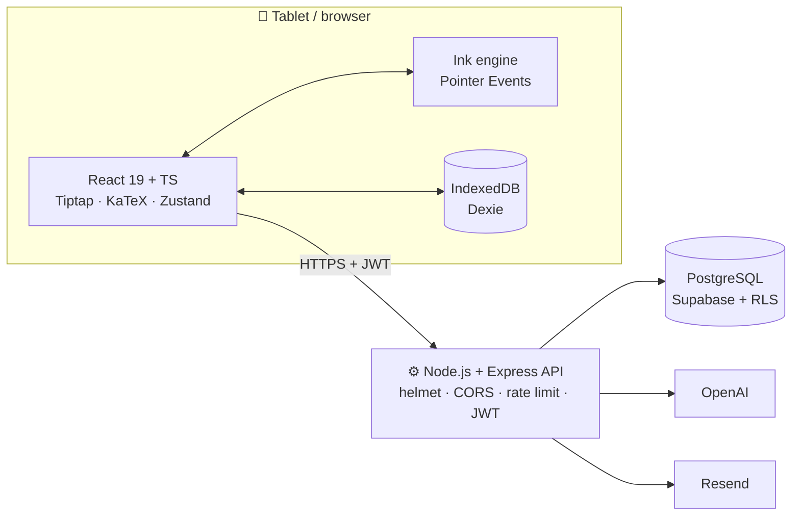
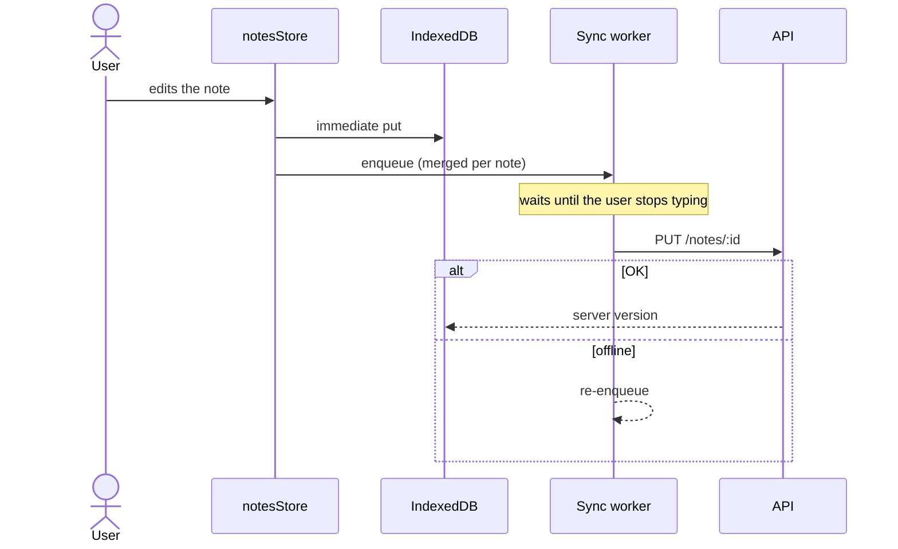
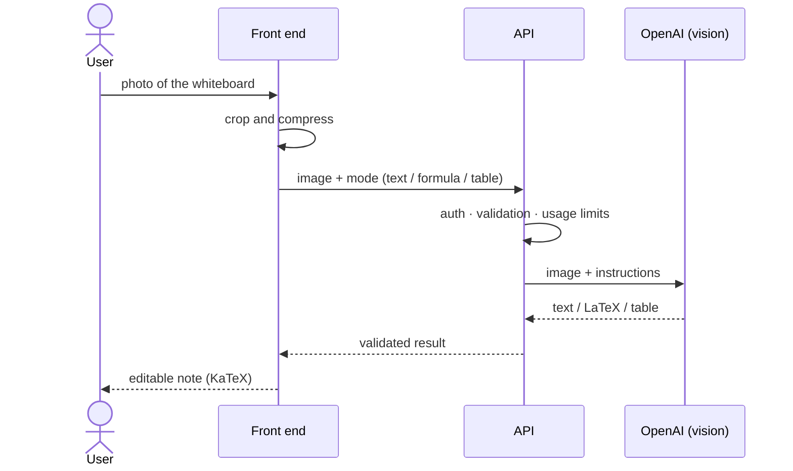
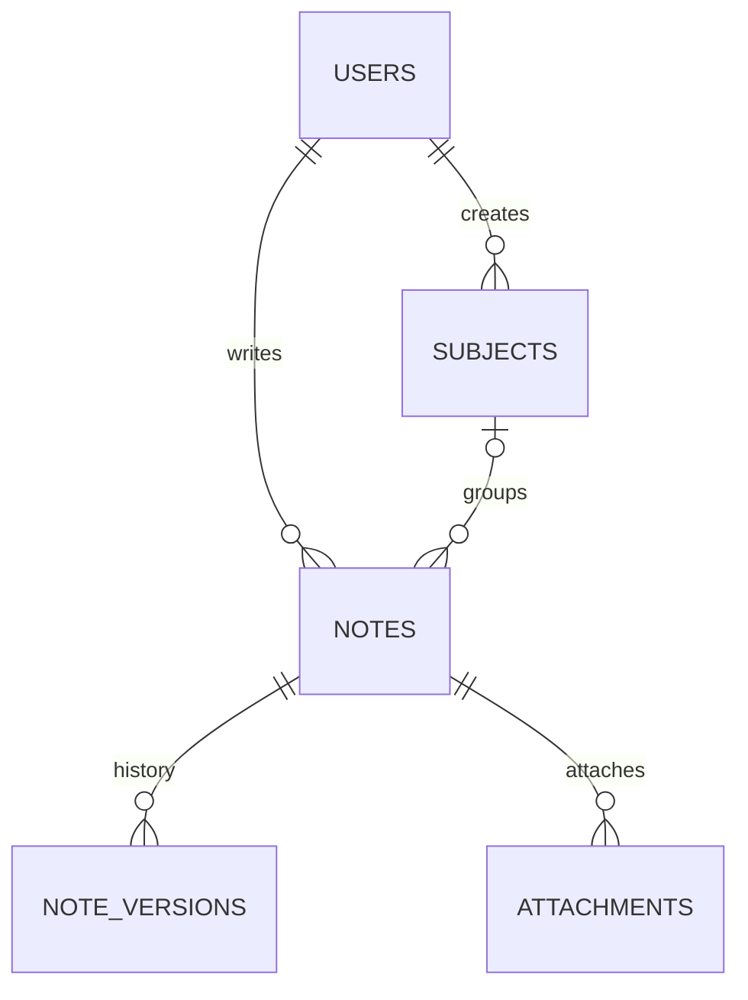

  <a href="README.md">🇪🇸 Español</a> · <a href="README.en.md">🇬🇧 English</a>

  <picture>
    <source media="(prefers-color-scheme: dark)" srcset="assets/banner-dark.svg">
    
  </picture>

<h3 align="center">Handwritten notes on your tablet, supercharged with AI</h3>

  A web app for taking stylus notes on Android tablets and iPad: low-latency inking, 
  handwritten formulas turned into LaTeX, photo OCR and an AI study assistant.

  
  
  
  
  
  
  
  
  
  
  

  
  
  
  

  <b><a href="#demo">Demo</a></b> ·
  <b><a href="#features">Features</a></b> ·
  <b><a href="#tech">Tech</a></b> ·
  <b><a href="#architecture">Architecture</a></b> ·
  <b><a href="#challenges">Challenges</a></b> ·
  <b><a href="#team">Team</a></b>

---

## 🎬 Demo

  <!-- TODO Marc: replace with assets/gifs/stylus-writing.gif once recorded -->
  

<!-- TODO Marc: demo URL. If the deployed app is public and shows no real data, add:

-->

## 💡 The problem

Engineering and technical students fill pages with formulas, diagrams and exercises. iPad users
have polished handwriting apps, but **Android** has no equivalent **built for technical subjects**,
and none of them turn what you write into something you can study with. Beta3M combines the
freedom of paper with a structured editor and an AI that understands your notes.

## ✨ Features

<table>
  <tr>
    <td width="33%" valign="top">
      <h4>✍️ Low-latency stylus</h4>
      Custom ink engine built on Pointer Events, coalesced events and a two-layer canvas/SVG renderer.
        
    </td>
    <td width="33%" valign="top">
      <h4>∑ Formulas → LaTeX</h4>
      Handwrite an equation and it becomes LaTeX rendered with KaTeX.
        
    </td>
    <td width="33%" valign="top">
      <h4>📷 Photo OCR</h4>
      Whiteboards, books and handouts become editable notes, including formulas and tables.
        
    </td>
  </tr>
  <tr>
    <td valign="top">
      <h4>🤖 AI for studying</h4>
      Improve, summarize, chat with your note, review questions and flashcards.
        
    </td>
    <td valign="top">
      <h4>🔷 Shapes & lasso</h4>
      Freehand shapes snap into clean geometry. The lasso selects, moves and resizes.
        
    </td>
    <td valign="top">
      <h4>🗂️ Subjects</h4>
      Color- and emoji-coded subjects, full-text search and version history.
        
    </td>
  </tr>
</table>

<table>
  <tr>
    <td>📴 <b>Offline-first</b> Write without a connection; it syncs when you're back online.</td>
    <td>📄 <b>Export</b> PDF and Markdown.</td>
    <td>🌗 <b>Light & dark mode</b> And PDFs always print readable.</td>
  </tr>
  <tr>
    <td>📏 <b>Ruler & tools</b> Pencil, fountain pen, highlighter, eraser and ruler.</td>
    <td>🔎 <b>Full-text search</b> PostgreSQL GIN, with an offline fallback.</td>
    <td>🧾 <b>Rich-text editor</b> Tiptap: tables, code, formulas, <code>/</code> commands.</td>
  </tr>
</table>

> 🧭 On the [roadmap](docs/roadmap.md): installable PWA, page backgrounds and left-handed mode.

## 🖼️ Gallery

<table>
  <tr>
    <td align="center"> Editor · light · landscape</td>
    <td align="center"> Editor · dark · landscape</td>
  </tr>
  <tr>
    <td align="center"> Photo → note · light · portrait</td>
    <td align="center"> AI · dark · portrait</td>
  </tr>
</table>

## ⚖️ How it compares

| | **Beta3M** | GoodNotes | Notion | Samsung Notes | Evernote |
|---|:---:|:---:|:---:|:---:|:---:|
| Stylus handwriting | ✅ | ✅ | ❌ | ✅ | ➖ |
| Structured text editor | ✅ | ➖ | ✅ | ➖ | ✅ |
| Handwritten formula → LaTeX | ✅ | ➖ | ❌ | ➖ | ❌ |
| Photo OCR with formulas | ✅ | ➖ | ❌ | ➖ | ➖ |
| AI review (questions, flashcards) | ✅ | ➖ | ➖ | ➖ | ❌ |
| Works offline | ✅ | ✅ | ➖ | ✅ | ➖ |
| Android + iPad + web | ✅ | ✅ | ✅ | ❌ | ✅ |
| Maturity & ecosystem | ➖ | ✅ | ✅ | ✅ | ✅ |

✅ yes · ➖ partial or paid · ❌ no. Indicative comparison (2026): other apps' features change often.

## 🛠️ Tech stack

| Layer | Technology | Why |
|---|---|---|
| UI |  | React 19 with strict TypeScript. Vite for fast builds and Tailwind 4 for the design system. |
| Editor | **Tiptap 3** + **KaTeX** | Extensible editor (custom formula and chart blocks) and fast LaTeX rendering without MathJax. |
| Ink | **Custom engine** (Pointer Events, Canvas, SVG) | No library offered the latency and control we needed. |
| State | **Zustand** | Small per-domain stores; selectors keep the editor from re-rendering. |
| Offline | **Dexie** (IndexedDB) | Typed local persistence and transactions for the sync queue. |
| API |  | Express 5 (CommonJS): routes → controllers → services. |
| Data |  | PostgreSQL for GIN full-text search, partial indexes and RLS. |
| Security | **bcrypt · JWT · helmet · express-rate-limit** | Defense in depth: see [security.md](docs/security.md). |
| AI | **OpenAI** `gpt-4o-mini` + vision | Good cost/quality balance, JSON outputs and image OCR. |
| Email | **Resend** | Account verification and password reset. |
| Deploy |  **Vercel** + **Railway** | Static front end on a CDN and an API with continuous deployment from Git. |
| Tests | **Vitest** · `node:test` | Canvas geometry, validation, controllers and the AI client. |

## 🏗️ Architecture

<b>Flow: write → save locally → sync</b>

<b>Flow: photo → OCR → AI → note</b>

📚 Technical docs (Spanish): [architecture](docs/architecture.md) · [ink engine](docs/ink-engine.md) · [offline & sync](docs/offline-sync.md) · [AI & OCR](docs/ai-features.md) · [security](docs/security.md)

## 🗄️ Data model

Full-text search with a **GIN** index, trigrams for partial matches, partial indexes over live notes
and triggers for `updated_at` and word counts. **Coming next**: normalized tags, AI usage analytics
and Stripe subscriptions → [database.md](docs/database.md).

## 🧗 Technical challenges

<b>✍️ Stylus latency</b>: making writing feel like paper

**Problem.** A stylus reports at 120–240 Hz, but the browser delivers a single `pointermove` per
frame, and React re-renders on every `setState`. Fast writing produced jagged curves and a stroke
lagging behind the pen tip.

**Solution.**
- `getCoalescedEvents()` recovers every intermediate sample in the frame.
- Points live in a `useRef`: **zero `setState` per point**.
- Redraws batched with `requestAnimationFrame` (at most one per frame).
- **Two layers**: a canvas for the live stroke and SVG for finished strokes, which are never redrawn.
- Canvas size × `devicePixelRatio` via `ResizeObserver` for crisp HiDPI strokes.

**Result.** The stroke follows the tip at the display's refresh rate, and React only hears about it
when you lift the pen. → [ink-engine.md](docs/ink-engine.md) · [`InkCanvas.tsx`](code-samples/frontend/ink/InkCanvas.tsx)

<b>🖐️ Palm rejection & gestures</b>

**Problem.** While writing, your palm touches the screen and draws, or scrolls the page.

**Solution.** An **active pointer map** (`pointerId → position`) decides what each contact is:
the pen draws, a single finger is ignored in pen-only mode, two fingers pan. With
`touch-action: none` and pointer capture, the browser never hijacks the gesture.

**Result.** Rest your hand and pan with two fingers without switching tools.
→ [`useMultiTouch.ts`](code-samples/frontend/hooks/useMultiTouch.ts)

<b>🔷 Shape recognition without AI</b>

**Problem.** Sending every shape to a model would be slow and expensive. And the first algorithm
("similar radii from the center") turned squares into circles.

**Solution.** Pure on-device geometry: a **fill ratio** (shoelace polygon area ÷ bounding-box area:
rectangle ≈ 1, circle ≈ π/4, triangle ≈ ½), corner detection for ambiguous cases and an area check
for triangles.

**Result.** Instant classification, offline and free. → [`shapeDetection.ts`](code-samples/frontend/ink/shapeDetection.ts)

<b>📴 Offline-first & conflicts</b>

**Problem.** Classroom Wi-Fi fails, and losing a note is unacceptable.

**Solution.** Two layers: **IndexedDB instantly**, and the API later through a queue that merges
changes per note and uploads them once the user stops typing. Notes created offline get
**negative temporary ids**; pending deletions stop notes from "coming back". Conflicts are resolved
with last-write-wins on `updated_at`, with version history as a safety net.

**Result.** Writing never waits for the network. On reconnect, everything is uploaded in order.
→ [offline-sync.md](docs/offline-sync.md) · [`notesStore.ts`](code-samples/frontend/store/notesStore.ts)

<b>💸 AI with cost control</b>

**Problem.** Every call costs money, and a timeout must not end in three paid retries nobody reads.

**Solution.** A small model by default and vision only for images; `max_tokens` per feature;
trimmed context; size validation before calling; **retries with backoff and jitter inside an overall
deadline**; validated JSON outputs; per-user usage limits. Handwriting recognition went from two
calls to one.

**Result.** Predictable cost per action and clear errors (503 / 504 / 502) instead of endless waits.
→ [ai-features.md](docs/ai-features.md) · [`openai.client.js`](code-samples/backend/services/openai.client.js)

<b>🌗 Dark mode in PDF export</b>

**Problem.** With the dark theme on, PDFs came out with a black background and light text:
unreadable on paper and a waste of ink.

**Solution.** Export uses the browser's print engine (perfect typographic fidelity) with an
`@media print` stylesheet that **forces the light palette** whatever the theme, hides the UI and
floating controls, and switches type to points.

**Result.** The same note looks dark on screen and clean on paper.

## 📊 Project metrics

  
  
  
  
  

| | |
|---|---|
| 🧩 React components (`.tsx` / `.jsx`) | 84 |
| 🪝 Custom hooks | 24 |
| 🌐 REST endpoints | 45 |
| 🧪 Test files | 10 (Vitest + `node:test`) |
| 📅 Development | since February 2026 |

Non-blank lines, excluding dependencies, builds and tests.

## 🗺️ Roadmap

- [x] Ink engine, shapes, lasso and ruler
- [x] Handwriting → text and LaTeX · photo OCR
- [x] AI: improve, summarize, chat, review, flashcards
- [x] Offline-first with sync
- [x] Full-text search and version history
- [ ] 🚧 Installable PWA (service worker)
- [ ] 🚧 Page backgrounds · performance with thousands of strokes
- [ ] 🔭 Left-handed mode · Stripe · collaboration

→ [Full roadmap](docs/roadmap.md)

## 👥 Team

<table align="center">
  <tr>
    <td align="center" width="50%">
       
      <b>Marc Gálvez</b> 
      Front end · ink engine · interface AI, OCR and sync  
      
      <!-- TODO Marc: LinkedIn -->
    </td>
    <td align="center" width="50%">
      <!-- TODO Marc: confirm the link and that Ignasi agrees to appear here -->
       
      <b>Ignasi (Nacho) Palau</b> 
      Back end · API · database AI, OCR and sync  
      
    </td>
  </tr>
</table>

Final project for the Multiplatform Application Development (DAM) vocational degree.

## 🔒 About the code

> **The full source code is private.** This repository showcases the architecture, technical decisions
> and [selected excerpts](code-samples/). If you're a recruiter and would like to see more,
> get in touch and I'll give you a **live demo**.
>
> 📬 <!-- TODO Marc: contact link (LinkedIn / email) --> Contact: via my [GitHub profile](https://github.com/marcgalvez2006).

© 2026 Marc Gálvez & Ignasi Palau. **All rights reserved**: see [LICENSE](LICENSE).
You may view this content for evaluation purposes; copying, modifying or redistributing it is not permitted.

---

  Made with ☕ in Barcelona 
  <a href="#top">⬆ Back to top</a>

