

  <a href="README.md">🇪🇸 Español</a> · <a href="README.en.md">🇬🇧 English</a>

  <picture>
    <source media="(prefers-color-scheme: dark)" srcset="assets/banner-dark.svg">
    
  </picture>

<h3 align="center">Apuntes a mano en tablet, potenciados con IA</h3>

  App web para tomar apuntes con stylus en tablets Android e iPad: escritura de baja latencia, 
  fórmulas manuscritas convertidas en LaTeX, OCR de fotos y un asistente de estudio con IA.

  
  
  
  
  
  
  
  
  
  
  

  
  
  
  

  <b><a href="#demo">Demo</a></b> ·
  <b><a href="#features">Features</a></b> ·
  <b><a href="#tech">Tech</a></b> ·
  <b><a href="#arquitectura">Arquitectura</a></b> ·
  <b><a href="#retos">Retos</a></b> ·
  <b><a href="#equipo">Equipo</a></b>

---

## 🎬 Demo

  <!-- TODO Marc: sustituir por assets/gifs/stylus-writing.gif cuando esté grabado -->
  

<!-- TODO Marc: URL demo. Si la web desplegada es pública y no muestra datos reales, añadir aquí:

-->

## 💡 El problema

Los estudiantes de carreras y ciclos técnicos llenan páginas de fórmulas, diagramas y
ejercicios. En iPad tienen apps de apuntes a mano muy pulidas, pero en **Android** no hay una
alternativa equivalente **pensada para asignaturas técnicas**, y ninguna convierte lo que escribes
en algo con lo que estudiar. Beta3M une la libertad del papel con un editor estructurado
y una IA que entiende tus apuntes.

## ✨ Features

<table>
  <tr>
    <td width="33%" valign="top">
      <h4>✍️ Stylus de baja latencia</h4>
      Motor de tinta propio con Pointer Events, eventos agrupados y doble capa canvas/SVG.
        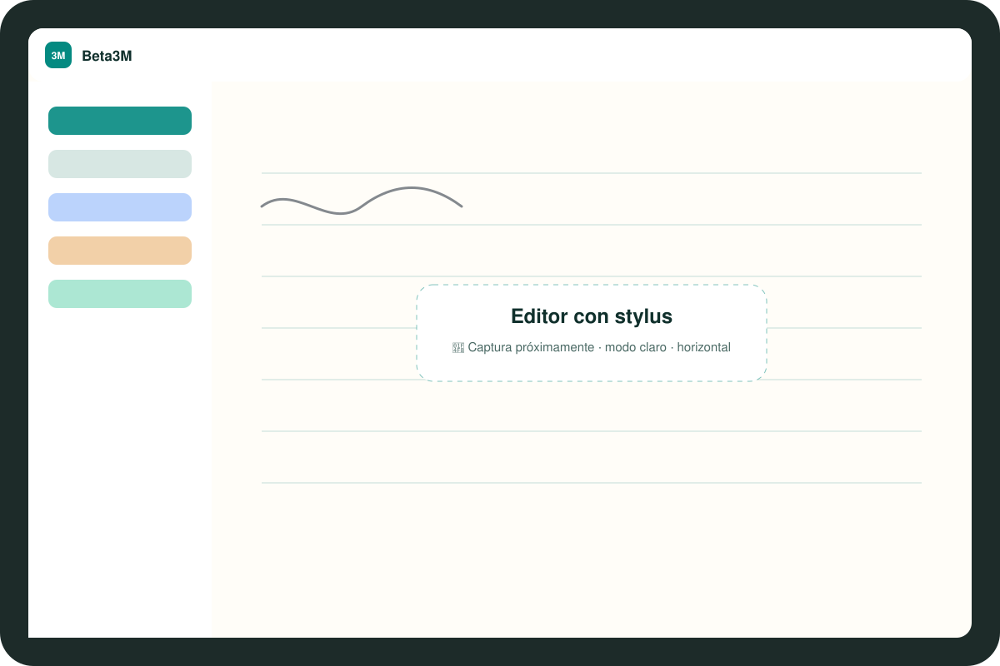
    </td>
    <td width="33%" valign="top">
      <h4>∑ Fórmulas → LaTeX</h4>
      Escribe una ecuación a mano y se convierte en LaTeX renderizado con KaTeX.
        
    </td>
    <td width="33%" valign="top">
      <h4>📷 OCR de fotos</h4>
      Pizarras, libros y fichas pasan a ser un apunte editable, con fórmulas y tablas.
        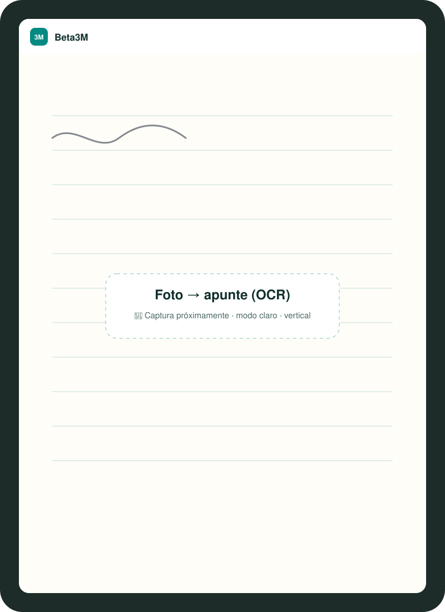
    </td>
  </tr>
  <tr>
    <td valign="top">
      <h4>🤖 IA para estudiar</h4>
      Mejorar, resumir, chatear con la nota, preguntas de repaso y flashcards.
        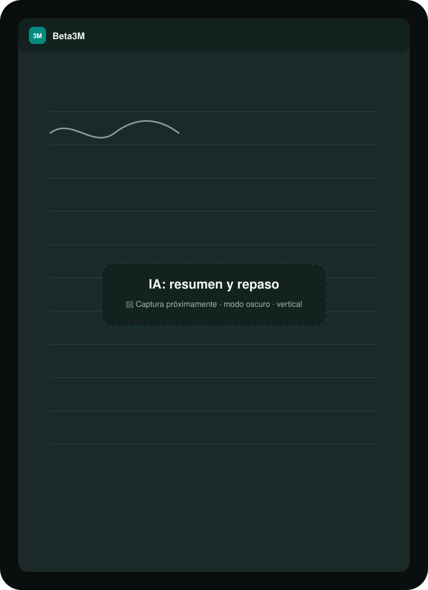
    </td>
    <td valign="top">
      <h4>🔷 Formas y lazo</h4>
      Las figuras a mano alzada se enderezan solas. El lazo selecciona, mueve y redimensiona.
        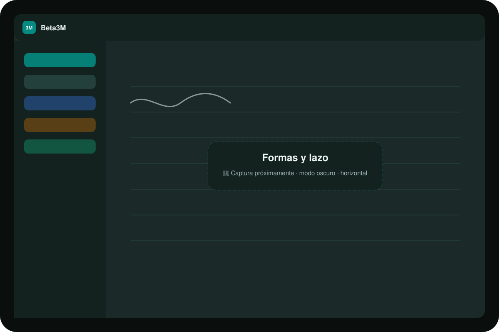
    </td>
    <td valign="top">
      <h4>🗂️ Asignaturas</h4>
      Organización por asignaturas con color y emoji, búsqueda full-text e historial de versiones.
        
    </td>
  </tr>
</table>

<table>
  <tr>
    <td>📴 <b>Offline-first</b> Escribe sin conexión: se sincroniza al volver la red.</td>
    <td>📄 <b>Exportación</b> PDF y Markdown.</td>
    <td>🌗 <b>Modo claro y oscuro</b> Y el PDF sale siempre legible.</td>
  </tr>
  <tr>
    <td>📏 <b>Regla y herramientas</b> Lápiz, pluma, subrayador, goma y regla.</td>
    <td>🔎 <b>Búsqueda full-text</b> PostgreSQL GIN, con alternativa offline.</td>
    <td>🧾 <b>Editor enriquecido</b> Tiptap: tablas, código, fórmulas, comandos <code>/</code>.</td>
  </tr>
</table>

> 🧭 En el [roadmap](docs/roadmap.md): PWA instalable, fondos de página y modo zurdo.

## 🖼️ Galería

<table>
  <tr>
    <td align="center"> Editor · claro · horizontal</td>
    <td align="center">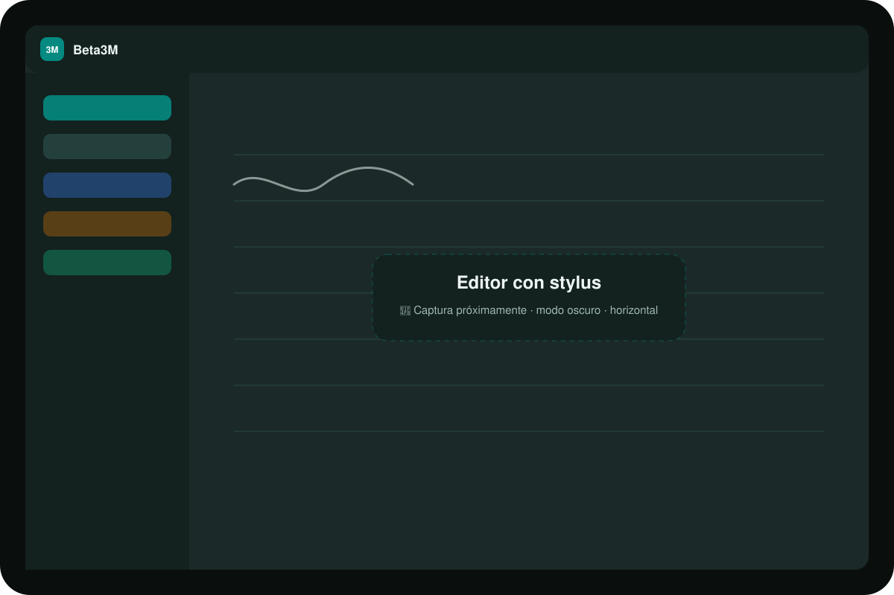 Editor · oscuro · horizontal</td>
  </tr>
  <tr>
    <td align="center"> Foto → apunte · claro · vertical</td>
    <td align="center"> IA · oscuro · vertical</td>
  </tr>
</table>

## ⚖️ Comparativa

| | **Beta3M** | GoodNotes | Notion | Samsung Notes | Evernote |
|---|:---:|:---:|:---:|:---:|:---:|
| Escritura a mano con stylus | ✅ | ✅ | ❌ | ✅ | ➖ |
| Editor de texto estructurado | ✅ | ➖ | ✅ | ➖ | ✅ |
| Fórmula manuscrita → LaTeX | ✅ | ➖ | ❌ | ➖ | ❌ |
| OCR de fotos con fórmulas | ✅ | ➖ | ❌ | ➖ | ➖ |
| Repaso con IA (preguntas, flashcards) | ✅ | ➖ | ➖ | ➖ | ❌ |
| Funciona sin conexión | ✅ | ✅ | ➖ | ✅ | ➖ |
| Android + iPad + web | ✅ | ✅ | ✅ | ❌ | ✅ |
| Madurez y ecosistema | ➖ | ✅ | ✅ | ✅ | ✅ |

✅ sí · ➖ parcial o de pago · ❌ no. Comparativa orientativa (2026): las funciones de otras apps cambian a menudo.

## 🛠️ Tech stack

| Capa | Tecnología | Por qué |
|---|---|---|
| UI |  | React 19 y TypeScript estricto. Vite para builds rápidos y Tailwind 4 para el sistema de diseño. |
| Editor | **Tiptap 3** + **KaTeX** | Editor extensible (bloques propios de fórmulas y gráficos) y render de LaTeX rápido sin MathJax. |
| Tinta | **Motor propio** (Pointer Events, Canvas, SVG) | Ninguna librería daba la latencia y el control necesarios. |
| Estado | **Zustand** | Stores pequeños por dominio y selectores que evitan renders en el editor. |
| Offline | **Dexie** (IndexedDB) | Persistencia local tipada y transacciones para la cola de sincronización. |
| API |  | Express 5 en CommonJS, rutas → controladores → servicios. |
| Datos |  | PostgreSQL por la búsqueda full-text con GIN, los índices parciales y RLS. |
| Seguridad | **bcrypt · JWT · helmet · express-rate-limit** | Defensa en capas: ver [security.md](docs/security.md). |
| IA | **OpenAI** `gpt-4o-mini` + visión | Buen equilibrio coste/calidad, salidas JSON y OCR de imágenes. |
| Email | **Resend** | Verificación de cuenta y recuperación de contraseña. |
| Deploy |  **Vercel** + **Railway** | Front estático en CDN y API con despliegue continuo desde Git. |
| Tests | **Vitest** · `node:test` | Geometría del lienzo, validación, controladores y cliente de IA. |

## 🏗️ Arquitectura

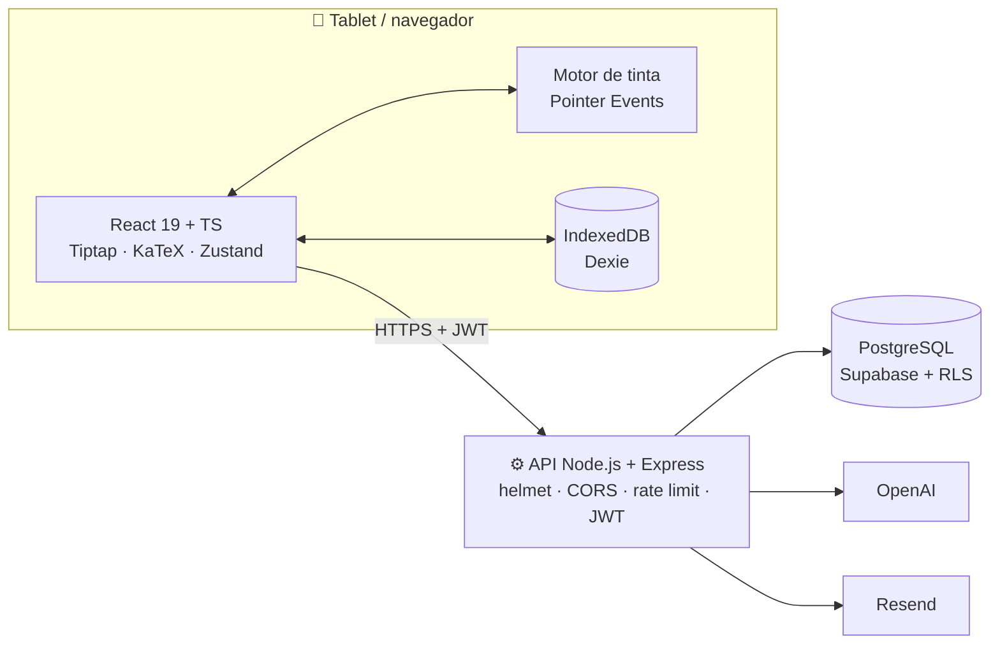

<b>Flujo: escribir → guardar en local → sincronizar</b>

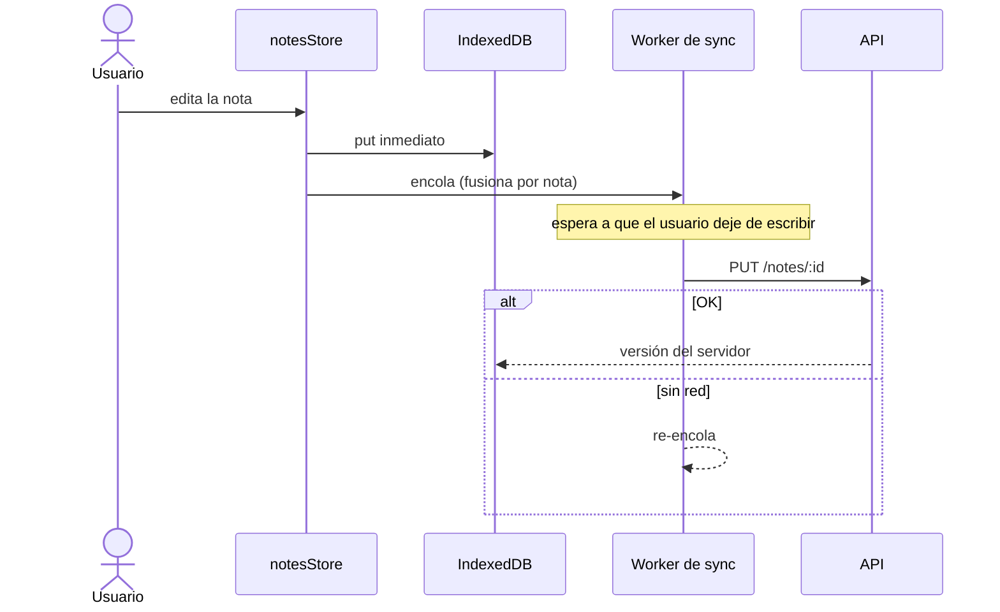

<b>Flujo: foto → OCR → IA → apunte</b>

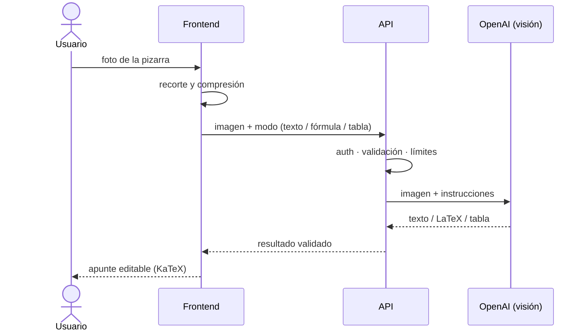

📚 Documentación técnica: [arquitectura](docs/architecture.md) · [motor de tinta](docs/ink-engine.md) · [offline y sync](docs/offline-sync.md) · [IA y OCR](docs/ai-features.md) · [seguridad](docs/security.md)

## 🗄️ Modelo de datos

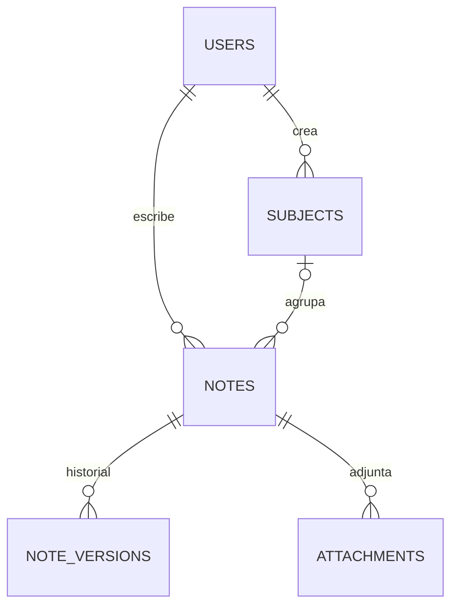

Full-text search con índice **GIN**, trigramas para búsqueda parcial, índices parciales sobre las
notas activas y triggers para `updated_at` y el recuento de palabras. **Próximas versiones**:
etiquetas normalizadas, analítica de uso de IA y suscripciones con Stripe → [database.md](docs/database.md).

## 🧗 Retos técnicos

<b>✍️ Latencia del stylus</b>: que escribir se sienta como en papel

**Problema.** Un stylus reporta a 120–240 Hz, pero el navegador entrega un solo `pointermove` por
frame, y React renderiza en cada `setState`. Escribiendo deprisa, las curvas salían a trozos
rectos y el trazo iba por detrás de la punta.

**Solución.**
- `getCoalescedEvents()` recupera todas las muestras intermedias del frame.
- Los puntos viven en un `useRef`: **cero `setState` por punto**.
- Repintado agrupado con `requestAnimationFrame` (máximo uno por frame).
- **Doble capa**: canvas para el trazo en vivo y SVG para los trazos terminados, que no se repintan.
- Tamaño del canvas × `devicePixelRatio` con `ResizeObserver`, para un trazo nítido en HiDPI.

**Resultado.** El trazo sigue a la punta a la tasa de refresco de la pantalla y React no se entera
hasta que levantas el lápiz. → [ink-engine.md](docs/ink-engine.md) · [`InkCanvas.tsx`](code-samples/frontend/ink/InkCanvas.tsx)

<b>🖐️ Palm rejection y gestos</b>

**Problema.** Al escribir, la palma toca la pantalla y pinta, o hace scroll.

**Solución.** Un **mapa de punteros activos** (`pointerId → posición`) decide qué es cada contacto:
el lápiz dibuja, un dedo se ignora en modo solo lápiz y dos dedos desplazan la página. Con
`touch-action: none` y *pointer capture*, el navegador no se queda el gesto.

**Resultado.** Puedes apoyar la mano y desplazarte con dos dedos sin cambiar de herramienta.
→ [`useMultiTouch.ts`](code-samples/frontend/hooks/useMultiTouch.ts)

<b>🔷 Reconocer figuras sin IA</b>

**Problema.** Enviar cada figura a un modelo sería lento y caro. Y el primer algoritmo
("radios parecidos al centro") convertía los cuadrados en círculos.

**Solución.** Geometría pura en el dispositivo: **ratio de relleno** (área por la fórmula de Gauss
÷ área de la caja: rectángulo ≈ 1, círculo ≈ π/4, triángulo ≈ ½), detección de esquinas para
los casos dudosos y validación de áreas para los triángulos.

**Resultado.** Clasificación instantánea, sin red y sin coste. → [`shapeDetection.ts`](code-samples/frontend/ink/shapeDetection.ts)

<b>📴 Offline-first y conflictos</b>

**Problema.** En clase el wifi falla, y perder un apunte es inaceptable.

**Solución.** Dos capas: **IndexedDB al instante** y la API en diferido mediante una cola que
fusiona cambios por nota y los sube cuando el usuario deja de escribir. Las notas creadas sin
conexión usan **ids temporales negativos**; los borrados pendientes evitan que una nota "resucite".
Los conflictos se resuelven con *last-write-wins* por `updated_at`, con el historial de versiones como red de seguridad.

**Resultado.** Escribir nunca espera a la red. Al reconectar se sube todo en orden.
→ [offline-sync.md](docs/offline-sync.md) · [`notesStore.ts`](code-samples/frontend/store/notesStore.ts)

<b>💸 IA con control de coste</b>

**Problema.** Cada llamada cuesta dinero, y un timeout no debe acabar en tres reintentos pagados que nadie lee.

**Solución.** Modelo pequeño por defecto y visión solo con imágenes; `max_tokens` por función;
contexto recortado; validación de tamaño antes de llamar; **reintentos con *backoff* y *jitter* dentro
de un plazo total**; salidas JSON validadas; límites de uso por usuario. El reconocimiento de
escritura pasó de dos llamadas a una.

**Resultado.** Coste por acción predecible y errores claros (503 / 504 / 502) en lugar de esperas
infinitas. → [ai-features.md](docs/ai-features.md) · [`openai.client.js`](code-samples/backend/services/openai.client.js)

<b>🌗 Modo oscuro en la exportación a PDF</b>

**Problema.** Con el tema oscuro activo, el PDF salía con fondo negro y texto claro: ilegible al
imprimirlo y un desperdicio de tinta.

**Solución.** La exportación usa el motor de impresión del navegador (fidelidad tipográfica
perfecta) con una hoja `@media print` que **fuerza la paleta clara** sea cual sea el tema, oculta
la interfaz y los controles flotantes y ajusta la tipografía a puntos.

**Resultado.** El mismo apunte se ve oscuro en pantalla y limpio en papel.

## 📊 Métricas del proyecto

  
  
  
  
  

| | |
|---|---|
| 🧩 Componentes React (`.tsx` / `.jsx`) | 84 |
| 🪝 Hooks propios | 24 |
| 🌐 Endpoints REST | 45 |
| 🧪 Archivos de test | 10 (Vitest + `node:test`) |
| 📅 Desarrollo | desde febrero de 2026 |

Líneas sin contar las vacías, ni dependencias, builds o tests.

## 🗺️ Roadmap

- [x] Motor de tinta, formas, lazo y regla
- [x] Escritura → texto y LaTeX · OCR de fotos
- [x] IA: mejorar, resumir, chat, repaso, flashcards
- [x] Offline-first con sincronización
- [x] Búsqueda full-text e historial de versiones
- [ ] 🚧 PWA instalable (service worker)
- [ ] 🚧 Fondos de página · rendimiento con miles de trazos
- [ ] 🔭 Modo zurdo · Stripe · colaboración

→ [Roadmap completo](docs/roadmap.md)

## 👥 Equipo

<table align="center">
  <tr>
    <td align="center" width="50%">
       
      <b>Marc Gálvez</b> 
      Frontend · motor de tinta · interfaz IA, OCR y sincronización  
      
      
      
    </td>
    <td align="center" width="50%">
      <!-- TODO Marc: confirmar enlace y que Ignasi está de acuerdo en aparecer -->
       
      <b>Ignasi (Nacho) Palau</b> 
      Backend · API · base de datos IA, OCR y sincronización  
      
    </td>
  </tr>
</table>

Proyecto de final de ciclo de Desarrollo de Aplicaciones Multiplataforma (DAM).

## 🔒 Sobre el código

> **El código fuente completo es privado.** Este repositorio muestra la arquitectura, las decisiones
> técnicas y [extractos seleccionados](code-samples/). Si eres reclutador/a y quieres ver más,
> escríbeme y hago una **demo en directo**.
>
> 📬 Contacto: [marcgalvezcomajuan@gmail.com](mailto:marcgalvezcomajuan@gmail.com) · [LinkedIn — Marc Gálvez Comajuan](https://www.linkedin.com/search/results/people/?keywords=Marc%20G%C3%A1lvez%20Comajuan)

© 2026 Marc Gálvez & Ignasi Palau. **Todos los derechos reservados**: ver [LICENSE](LICENSE).
Se permite ver el contenido con fines de evaluación; no se permite copiarlo, modificarlo ni redistribuirlo.

---

  Hecho con ☕ en Barcelona 
  <a href="#top">⬆ Volver arriba</a>

