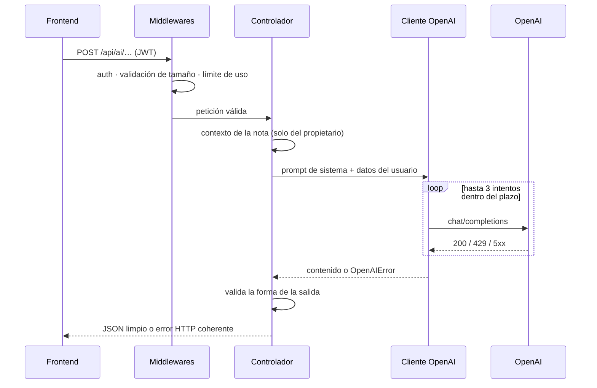

# 🤖 IA y OCR

[← Volver al README](../README.md) · Código: [`ai.controller.js`](../code-samples/backend/controllers/ai.controller.js) · [`openai.client.js`](../code-samples/backend/services/openai.client.js)

> Los prompts de sistema son parte del producto y **no se publican**. Aquí se explica qué hace
> cada función, cómo se integra y cómo se controla el coste.

## Funciones

| Función | Qué hace | Modelo |
|---|---|---|
| ✨ **Mejorar apunte** | Corrige ortografía, estructura en títulos y listas, y resalta conceptos clave. | `gpt-4o-mini` |
| 📝 **Resumir** | Resumen breve más puntos clave, en el idioma del apunte. | `gpt-4o-mini` |
| 💬 **Chat con tus apuntes** | Preguntas sobre la nota abierta, con sugerencias de seguimiento. | `gpt-4o-mini` (JSON) |
| 🧠 **Repaso** | Genera preguntas abiertas, tipo test y flashcards a partir de la nota. | `gpt-4o-mini` (JSON) |
| 🌍 **Transformar selección** | Traducir, explicar, resolver paso a paso o extraer tareas. | `gpt-4o-mini` |
| 🏷️ **Sugerir asignatura** | Propone en qué asignatura encaja una nota. | `gpt-4o-mini` |
| ✍️ **Escritura → texto** | Reconoce lo escrito a mano línea a línea. | visión |
| ∑ **Escritura → LaTeX** | Fórmulas manuscritas → LaTeX renderizado con KaTeX. | visión |
| 📷 **Foto → apunte** | OCR de pizarras, libros o fichas, incluidas fórmulas y tablas. | visión |
| 📊 **Tabla ↔ gráfico** | Una tabla del apunte se convierte en gráfico (Chart.js) y viceversa. | visión / local |

## Flujo de una petición

## Control de coste

- **Modelo pequeño por defecto** (`gpt-4o-mini`). El modelo con visión solo se usa cuando hay una imagen.
- **`max_tokens` por función**, ajustado a lo que se pide: un resumen no necesita lo mismo que resolver un ejercicio.
- **Contexto acotado**: la nota se recorta a un máximo de caracteres y el historial del chat se limita a los últimos mensajes.
- **Validación de tamaño** antes de llamar a la API: las peticiones enormes se rechazan sin gastar tokens.
- **Plazo total**: los reintentos se cortan cuando el usuario ya habría visto un timeout. No tiene sentido pagar una respuesta que nadie va a leer.
- **Sin llamadas duplicadas**: el OCR de escritura corrige y reconoce en una sola petición. Antes eran dos.
- **Límites de uso por usuario y rate limiting** en las rutas de IA.
- **Heurísticas locales primero**: la detección de figuras y la decisión fórmula/texto se hacen en el dispositivo, sin IA.

## Robustez

- **Reintentos con *backoff* exponencial y *jitter*** solo en errores transitorios (429, 5xx, red), respetando `Retry-After`.
- **Salidas estructuradas** (`response_format: json_object`) y **validación** de lo que devuelve el modelo: las preguntas mal formadas se descartan antes de llegar al cliente.
- **Prompt injection**: el contenido del usuario se delimita y se trata como datos, nunca como instrucciones. El rol `system` solo lo pone el servidor; el cliente no puede enviarlo.
- **Salidas que acaban en el DOM** (por ejemplo, paths SVG generados) se validan con una lista blanca de caracteres.
- **Errores mapeados**: saturación → 503, timeout → 504, fallo del modelo → 502. El mensaje es comprensible para el usuario y no filtra detalles.

## Privacidad

- La API key solo existe en el servidor.
- El contexto de una nota solo se lee si pertenece al usuario autenticado.
- Solo se envía a la IA lo necesario para la acción pedida.
