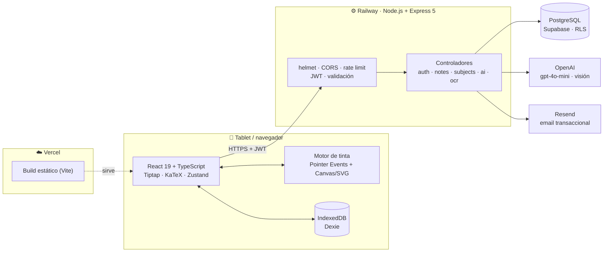
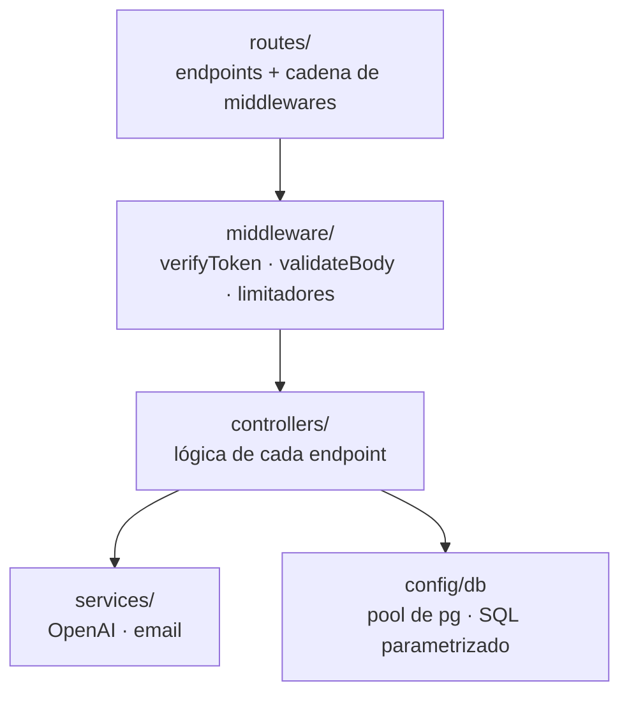
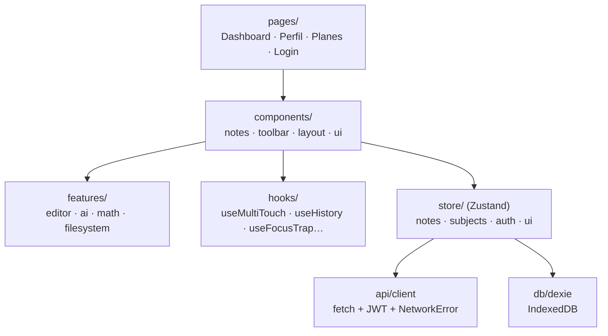
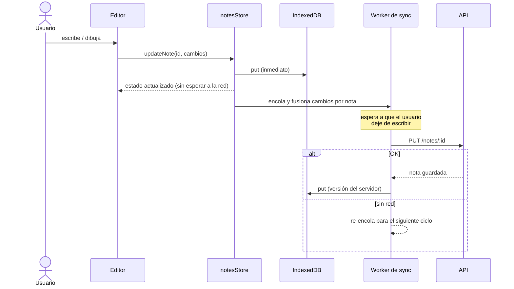
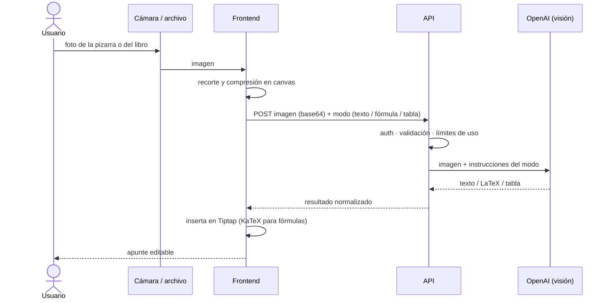

# 🏗️ Arquitectura

[← Volver al README](../README.md)

Beta3M es una SPA en React servida desde un CDN, que habla con una API REST propia en Node.js.
La API es la **única** que accede a la base de datos y a los servicios de IA: el cliente nunca
tiene claves de terceros.

## Vista general

## Capas del backend

- **Rutas declarativas**: cada endpoint enumera sus middlewares en orden (auth → validación → controlador). Ver [`notes.routes.js`](../code-samples/backend/routes/notes.routes.js).
- **SQL parametrizado** con `pg` (sin ORM): consultas explícitas y planes predecibles, que importan para la búsqueda full-text.
- **Integraciones aisladas en servicios**: el cliente de OpenAI gestiona timeouts, reintentos y la traducción de errores ([`openai.client.js`](../code-samples/backend/services/openai.client.js)).
- **Errores opacos**: el cliente recibe mensajes genéricos y el detalle solo queda en los logs del servidor.

## Estructura del frontend

- **Estado global con Zustand**: stores pequeños por dominio y sin *boilerplate*. Los temporizadores y las colas viven fuera de React.
- **El editor tiene dos mundos**: Tiptap para el texto enriquecido y una capa de **objetos flotantes** (trazos, fórmulas, figuras, imágenes) posicionados encima. Ver [ink-engine.md](ink-engine.md).
- **Cliente HTTP mínimo** que distingue los errores de red (`NetworkError`) de los del servidor. Es la base del modo offline ([offline-sync.md](offline-sync.md)).

## Flujo: escribir → guardar en local → sincronizar

## Flujo: foto → OCR → IA → apunte

## Decisiones clave

| Decisión | Alternativa descartada | Por qué |
|---|---|---|
| API propia entre cliente y BD | Cliente → Supabase directo | Las claves y la lógica de cuotas no salen nunca del servidor. RLS queda como segunda barrera. |
| `pg` + SQL a mano | ORM | Control total sobre la búsqueda full-text, los índices parciales y los JOIN. |
| Zustand | Redux / Context | Menos código, y los selectores evitan renders en el editor, que es la parte más pesada. |
| SVG + canvas en el lienzo | Solo canvas | El SVG da trazos vectoriales seleccionables y exportables. El canvas da el trazo en vivo a 60 fps. |
| Express 5 | Fastify / NestJS | Proyecto de 2 personas: ecosistema conocido y async nativo en los handlers. |
