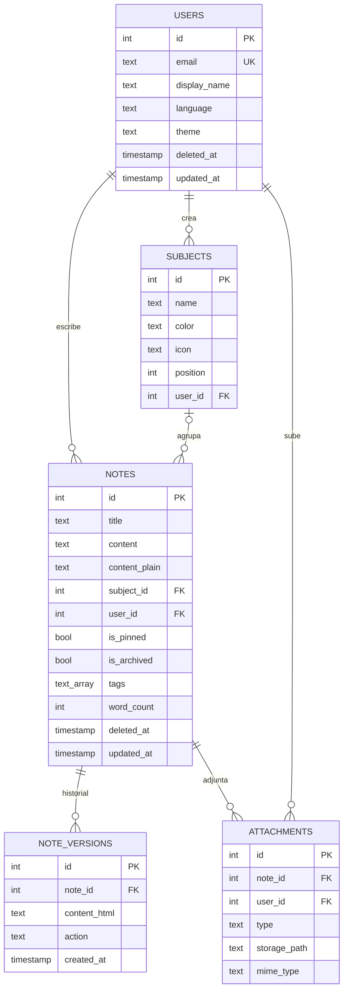
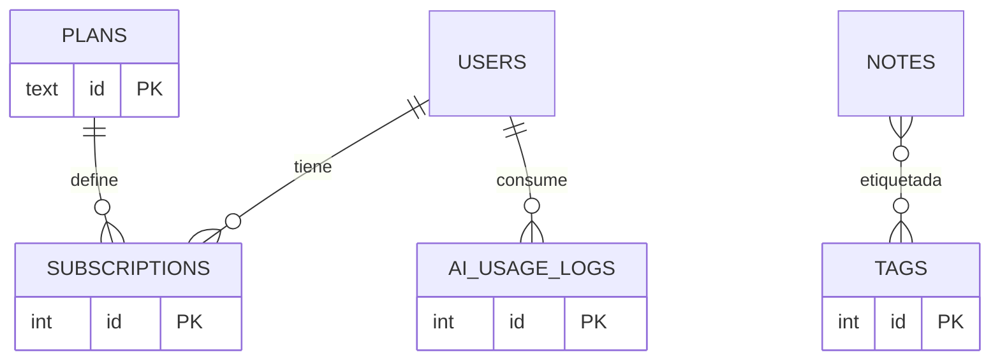

# 🗄️ Modelo de datos

[← Volver al README](../README.md)

PostgreSQL alojado en Supabase. El esquema simplificado está en
[`code-samples/backend/sql/schema.sql`](../code-samples/backend/sql/schema.sql).

## Diagrama entidad-relación (implementado)

## Decisiones de diseño

- **`content` + `content_plain`**: el HTML de Tiptap se guarda tal cual para renderizarlo, y una copia en texto plano alimenta la búsqueda y el contexto de la IA sin tener que parsear HTML en cada consulta.
- **Borrado lógico (`deleted_at`)**: la papelera y la restauración salen gratis. Los índices son **parciales** (`WHERE deleted_at IS NULL`), así que las notas borradas no penalizan el listado principal.
- **Full-text search con GIN** sobre `to_tsvector(title || content_plain)` y ranking con `ts_rank`. Si la consulta FTS no devuelve nada útil, la API recurre a `ILIKE`.
- **Trigramas (`pg_trgm`)** en el título, para búsquedas parciales del tipo "cinem" → *Cinemática*.
- **Triggers**: `updated_at` automático y recuento de palabras / tiempo de lectura calculados en la propia BD, de modo que ningún cliente puede dejarlos inconsistentes.
- **`ON DELETE SET NULL`** en `notes.subject_id`: borrar una asignatura no borra sus apuntes.
- **Historial de versiones** con el origen de cada cambio (`auto`, `manual`, `ai`, `restore`).

## Próximas versiones

| Versión | Cambio |
|---|---|
| v2 | Tabla `tags` normalizada (hoy es `TEXT[]` con índice GIN) y registro detallado del uso de IA para analítica de costes. |
| v3 | Suscripciones con Stripe (`plans`, `subscriptions`, webhooks) y colaboración en notas compartidas. |
