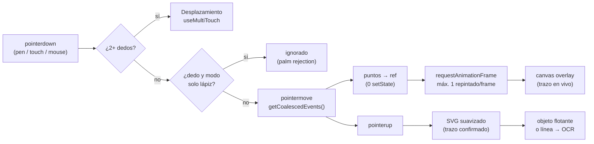
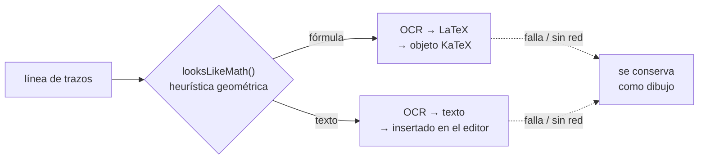

# ✍️ Motor de escritura (InkCanvas)

[← Volver al README](../README.md) · Código: [`InkCanvas.tsx`](../code-samples/frontend/ink/InkCanvas.tsx) · [`inkGeometry.ts`](../code-samples/frontend/ink/inkGeometry.ts) · [`shapeDetection.ts`](../code-samples/frontend/ink/shapeDetection.ts)

Escribir con un lápiz en una tablet tiene que **sentirse como papel**. Para eso el trazo debe
seguir la punta sin retraso apreciable y sin perder detalle cuando se escribe deprisa. Es la
parte técnicamente más exigente del proyecto, y por eso el motor está hecho a mano, sin librerías
de dibujo.

## Pipeline de un trazo

## 1. Latencia: dos capas y cero renders por punto

| Problema | Solución |
|---|---|
| Un stylus reporta a 120–240 Hz, pero el navegador entrega **un** `pointermove` por frame. Escribiendo rápido, las curvas salen a trozos rectos. | `getCoalescedEvents()` recupera todas las muestras intermedias del frame. |
| Hacer un `setState` por punto provoca cientos de renders de React por segundo. | Los puntos del trazo en curso viven en un `useRef`. React no se entera hasta que el trazo termina. |
| Repintar en cada evento satura el hilo principal. | El repintado se agrupa con `requestAnimationFrame`: como mucho uno por frame, aunque lleguen decenas de puntos. |
| Redibujar todos los trazos en cada frame no escala. | **Doble capa**: un `<canvas>` solo para el trazo en vivo (se limpia y se repinta entero, es barato) y un `<svg>` para los trazos ya hechos, que no se tocan. |
| En pantallas HiDPI el canvas se ve borroso. | Tamaño interno = tamaño CSS × `devicePixelRatio`, recalculado con `ResizeObserver`. |
| El navegador "roba" el gesto para hacer scroll. | `touch-action: none` en la superficie de dibujo y `setPointerCapture`. |

## 2. Trazo natural

- **Suavizado con curvas cuadráticas**: cada punto real hace de punto de control y el punto medio entre dos muestras de extremo. Así la curva es continua y no tiene picos, y el mismo algoritmo genera el SVG final.
- **Grosor según la velocidad**: la pluma estilográfica adelgaza al ir rápido y el lápiz responde de forma más suave. El subrayador limita su opacidad para no tapar el texto.
- **Herramientas**: lápiz, pluma, subrayador, goma, regla (los puntos se proyectan sobre la recta de la regla si están cerca), figuras y lazo de selección.

## 3. Palm rejection y gestos

`useMultiTouch` mantiene un **mapa de punteros activos** (`pointerId → posición`):

- **Lápiz** (`pointerType: 'pen'`): siempre dibuja.
- **Un dedo**: se ignora en modo "solo lápiz", que es lo que evita que la palma apoyada pinte.
- **Dos o más dedos**: el gesto pasa a ser desplazamiento y se cancela el dibujo.

## 4. De trazos a contenido

Cuando el usuario hace una pausa, los trazos se **agrupan por líneas** (cercanía vertical del
centro de cada trazo). Cada línea se renderiza en un canvas *offscreen* y se envía a reconocer:

`looksLikeMath` decide sin red, solo con geometría: varias rayas horizontales cortas (`=`, fracciones),
muchos trazos pequeños y redondeados (exponentes), o una línea más alta que ancha.
**Nunca se pierde lo escrito**: si el reconocimiento falla, el trazo queda como dibujo movible.

## 5. Reconocimiento de figuras sin IA

Al dibujar una figura y mantener el lápiz quieto, [`shapeDetection.ts`](../code-samples/frontend/ink/shapeDetection.ts)
la clasifica **en local y sin coste**:

- **Ratio de relleno**: área del polígono (fórmula de Gauss) ÷ área de su caja. Un rectángulo da ≈ 1, un círculo ≈ π/4 ≈ 0,785 y un triángulo ≈ 0,5.
- **Esquinas**: ángulos marcados en una versión submuestreada del trazo, para desempatar rectángulos girados frente a círculos.
- **Triángulos**: el par de puntos más alejados más el punto más lejano a esa recta; se valida comparando áreas.
- **Líneas**: desviación máxima respecto a la recta inicio-fin.

> Hubo un bug instructivo: el primer criterio ("radios parecidos al centro") también lo cumplían
> los cuadrados, así que todo acababa siendo un círculo. Cambiar el orden y usar el ratio de relleno lo resolvió.

## 6. Objetos flotantes

Cada grupo de trazos acaba siendo un **objeto flotante** (`FloatingObject`): tiene un path SVG con
coordenadas relativas a su propia caja, así que se puede mover, redimensionar y rotar sin recalcular
los puntos. El mismo modelo sirve para fórmulas, imágenes, figuras, conectores y stickers
([`models.ts`](../code-samples/frontend/types/models.ts)). Deshacer y rehacer funciona con una pila
de instantáneas que también se guarda en IndexedDB.

## Siguientes pasos

- `getPredictedEvents()` para adelantar el trazo unos milisegundos.
- Índice espacial y simplificación (Ramer–Douglas–Peucker) para páginas con miles de trazos.
- Redibujado por regiones sucias en lugar de la capa entera.
