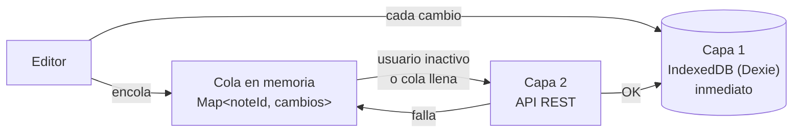
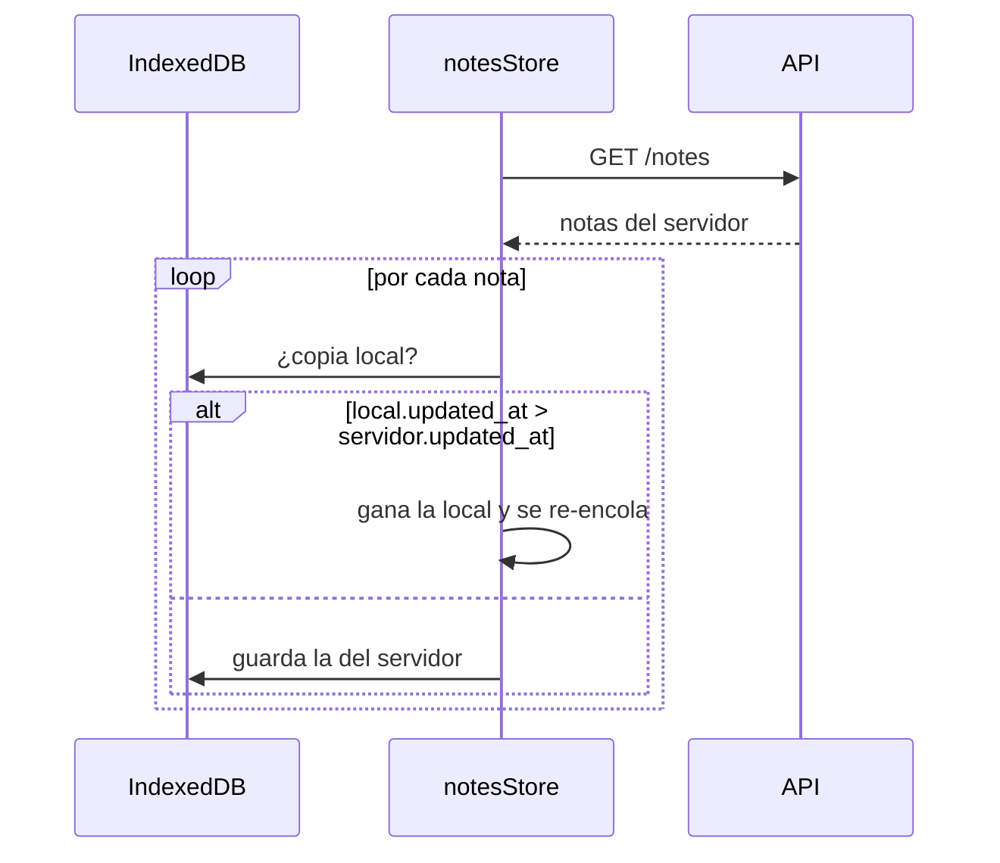

# 📴 Offline-first y sincronización

[← Volver al README](../README.md) · Código: [`notesStore.ts`](../code-samples/frontend/store/notesStore.ts)

En un aula, el wifi falla. Beta3M está pensada para que **escribir nunca dependa de la red**:
todo cambio se guarda primero en el dispositivo y se sube después, cuando se puede.

## Dos capas de persistencia

1. **IndexedDB, al instante.** La UI se actualiza sin esperar a nadie.
2. **API, en diferido.** Un *worker* revisa la cola periódicamente y sube los cambios cuando el usuario ha dejado de escribir, o antes si se acumulan demasiadas notas.
   - Los cambios sucesivos de una misma nota **se fusionan** en una sola petición.
   - Si una subida falla, la nota vuelve a la cola para el siguiente ciclo.

## Qué pasa sin conexión

| Acción offline | Cómo se resuelve |
|---|---|
| Editar una nota | Se guarda en IndexedDB y queda en la cola. |
| Crear una nota | Recibe un **id temporal negativo**. Al volver la red se crea en el servidor y el id temporal se sustituye por el real en una transacción de Dexie. |
| Borrar una nota | Se borra en local y su id se apunta en una lista de borrados pendientes. Así no "resucita" al recargar la lista del servidor. |
| Buscar | Se busca en local sobre título y texto plano. Con conexión, la búsqueda usa el full-text de PostgreSQL. |
| Cerrar la pestaña | Si hay cambios pendientes, se avisa al usuario antes de cerrar. |

Al recuperar la conexión (evento `online`) se vacía todo **en orden**: primero los borrados, luego las
notas nuevas y por último los cambios en cola. Así una nota creada offline existe en el servidor
antes de recibir ediciones.

## Conflictos

La estrategia es **last-write-wins por `updated_at`**: si el dispositivo tiene una versión más
reciente que el servidor (por ejemplo, editada sin red y con la pestaña cerrada antes de sincronizar),
gana la local y se vuelve a subir. Para un uso personal con uno o dos dispositivos es suficiente,
y el historial de versiones del servidor permite recuperar lo que se haya sobrescrito.

## Distinguir "sin red" de "error"

El cliente HTTP convierte los fallos de `fetch` en un `NetworkError` propio. Solo esos errores
activan el camino offline. Un 400 o un 500 se muestran al usuario como lo que son, en vez de
esconderse en una cola que nunca se va a vaciar.

## Siguientes pasos

- Service worker y manifest para instalarla como PWA y abrirla sin conexión desde el primer arranque.
- Cola persistida en IndexedDB (hoy la cola de ediciones vive en memoria; los datos ya están en IndexedDB, pero se re-detectan al recargar comparando fechas).
- Fusión de conflictos a nivel de bloque en lugar de nota completa.
